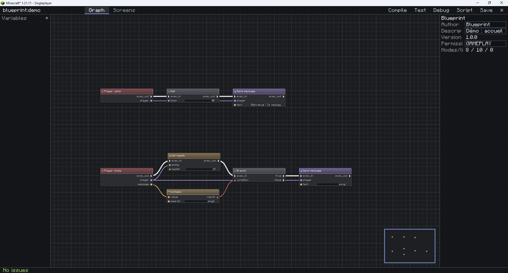
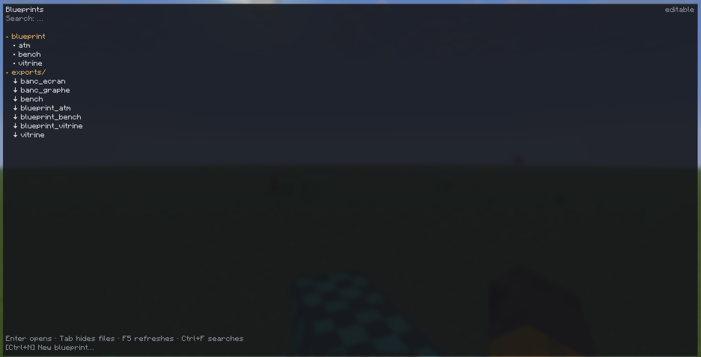
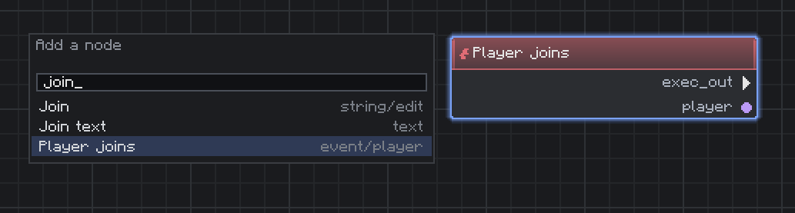
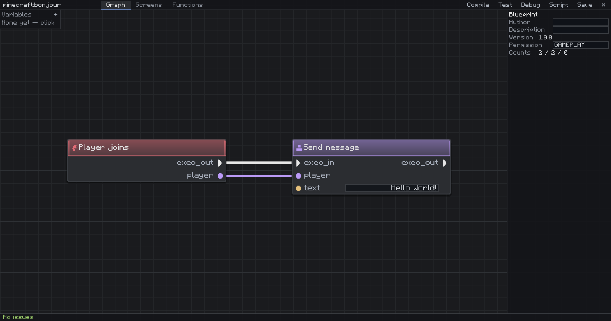
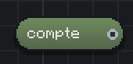
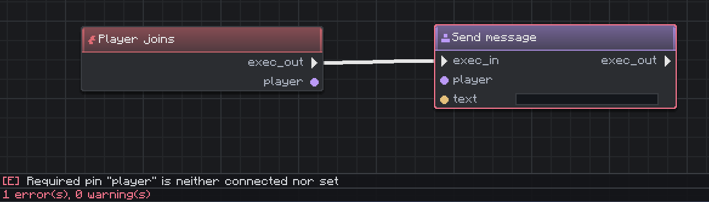
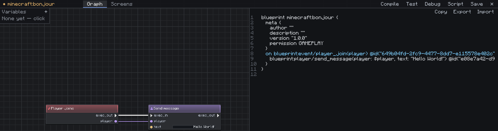
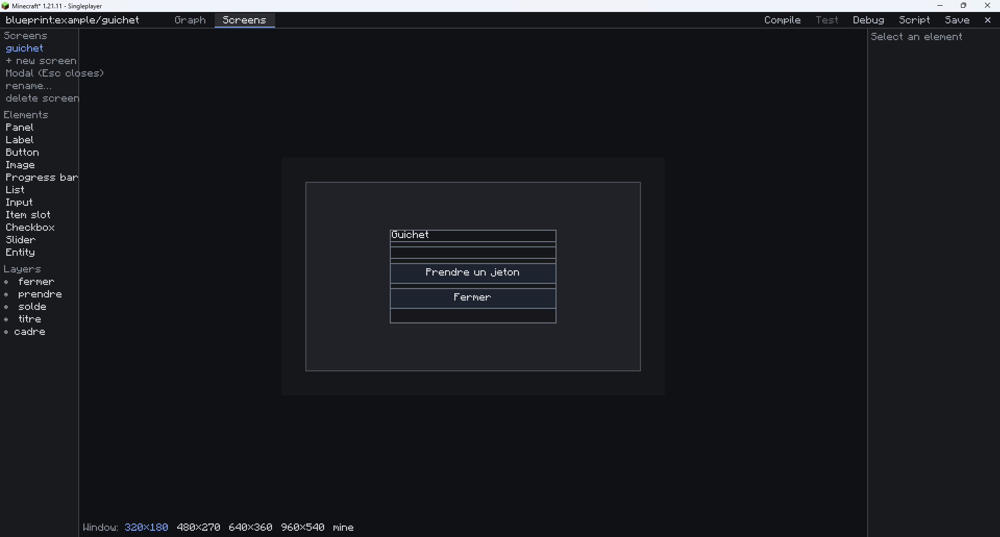

# Blueprint — prise en main

Ce guide s'adresse au **joueur**. Il ne demande pas de savoir programmer, et pas une
ligne de Java. Comptez dix minutes pour votre premier blueprint qui fait quelque chose.



*Ce que vous aurez sous les yeux : les nœuds au centre, les variables à gauche, les
informations du blueprint à droite, et la barre de diagnostics tout en bas.*

---

## 1. Qu'est-ce qu'un blueprint ?

Un **graphe** que vous posez en jeu : des **nœuds** reliés par des fils. Un nœud fait une
chose (« envoyer un message », « poser un bloc », « comparer deux nombres »), un fil dit
dans quel ordre — ou quelle valeur va où.

Deux sortes de fils, reconnaissables **à la forme des pins** autant qu'à leur couleur :

- **Exécution** (pins en flèche, fils épais) : l'ordre des actions.
- **Données** (pins ronds, losanges, triangles, anneaux, croix) : les valeurs qui
  circulent. La forme change avec le type, exprès — elle reste lisible en cas de
  daltonisme.

Un blueprint part d'un **événement** (un joueur se connecte, un bloc est cassé, une
commande est tapée…) et s'exécute **côté serveur**.

---

## 2. Ouvrir l'éditeur

| Ce que vous voulez | Ce que vous tapez |
|---|---|
| Lancer le banc de performance | `/blueprint bench` puis `/bench` |
| Créer le vôtre | `/blueprint create mon_premier` |
| Ouvrir le navigateur | Touche **F6** — double-clic pour ouvrir, Ctrl+N pour créer |
| Voir ce qui existe | **F6**, ou `/blueprint edit` — dossiers, création, import |

> **En solo**, tout fonctionne, y compris sans « autoriser les tricheurs ».
> **Sur un serveur**, l'édition demande la permission configurée par l'administrateur ;
> sans elle, l'éditeur s'ouvre en **lecture seule** et vous le dit.



*Le navigateur : en haut ceux qui vivent dans le monde, en dessous les fichiers du dossier
`exports/` — la flèche les distingue. `editable` en haut à droite dit qu'on a le droit
d'écrire ; sur un serveur sans la permission, il dirait le contraire.*

---

## 3. Votre premier blueprint en cinq gestes



*La palette cherche dans les **noms lisibles** autant que dans les identifiants, et la
colonne de droite dit d'où vient chaque résultat. « Player joins » vient de
`event/player` — c'est celui-là.*

1. `/blueprint create bonjour`
2. **Espace** ouvre la palette. Tapez `join`, choisissez **`blueprint:player_join`** :
   c'est l'événement de départ.
3. **Espace** encore, tapez `message`, choisissez **« Envoyer un message »**.
4. Tirez un fil depuis la **flèche de sortie** de l'événement vers la **flèche d'entrée**
   du message. Puis du pin `player` de l'événement vers le pin `player` du message.
5. Cliquez le champ texte du message, écrivez `Bonjour !`, **Ctrl+S**.

Cliquez **Tester** : le blueprint est enregistré et activé. Reconnectez-vous — le message
s'affiche.



*Après le geste 4, à mi-chemin : le fil épais d'exécution est tiré, mais `player` ne l'est
pas encore — d'où le **cadre rouge** autour du nœud de message. Il ne dit pas que vous avez
mal fait, il dit que ce n'est pas fini.*

Si un pin refuse de se connecter, ce n'est pas un bug : les types doivent correspondre.
Le fil devient rouge et la barre du bas dit pourquoi.

---

## 4. Les gestes qui servent tous les jours

| Souris | | Clavier | |
|---|---|---|---|
| Molette | Zoom | `Espace` | Palette |
| Clic milieu / clic droit glissé | Déplacer la vue | `Flèches` | Passer d'un nœud à l'autre |
| Clic sur un pin puis glisser | Câbler | `Entrée` | Éditer la première valeur du nœud |
| Alt + clic sur un pin | Détacher un fil | `Ctrl+S` | Enregistrer |
| Clic droit sur le vide | Palette au curseur | `Ctrl+Z` / `Ctrl+Y` | Annuler / Rétablir |
| Double-clic sur une valeur | La modifier | `Ctrl+C` / `Ctrl+V` | Copier / Coller |
| | | `Suppr` | Supprimer la sélection |
| | | `F` | Tout recadrer |
| | | `Q` | Aligner la sélection |
| | | `C` | Commentaire autour de la sélection |
| | | `Ctrl+F` | Chercher un nœud |
| | | `Tab` | Replier les panneaux |

---

## 5. Variables

Le panneau **Variables** (à gauche) crée des valeurs qui survivent entre deux
exécutions : un compteur, un état, un nom. Chaque variable a une **portée** :

- `graph` — propre au blueprint ;
- `player` — une valeur **par joueur**, et propre au blueprint ;
- `player_shared` — une par joueur, **lisible par vos autres blueprints** ;
- `world` — une pour le monde entier ;
- `local` — le temps d'une exécution seulement.

> Les deux portées joueur répondent à des questions différentes. `player` garde la valeur
> chez vous : un autre blueprint qui nommerait sa variable pareil ne peut pas la toucher.
> `player_shared` est le canal entre vos scripts — le prénom d'un personnage, écrit par
> celui qui le crée et lu par tous les autres. Dans le doute, `player` : on ouvre quand on
> en a besoin, on ne referme jamais sans casser quelque chose.

### Choisir le type

Sélectionnez la variable, cliquez sur **[T]** : un menu s'ouvre avec les types
disponibles, chacun avec sa pastille de couleur, et un point marque celui en place.

| Type | Ce qu'il garde |
|---|---|
| Nombre, Entier, Entier long | des valeurs numériques — `Nombre` dans le doute |
| Booléen | vrai ou faux |
| Chaîne | du texte |
| **Vecteur** | une position exacte, décimales comprises — un point de retour, une cible |
| **Position de bloc** | une case de la grille du monde |
| **Direction** | nord, sud, haut, bas… |

Les trois derniers sont récents : ils évitent de découper une position en trois variables
`Nombre` et de la recomposer à chaque usage.

> **Changer le type d'une variable déjà câblée** peut rendre des liens incompatibles.
> L'éditeur ne les casse pas en silence : le premier clic affiche le nombre de liens
> concernés en bas du panneau, le second applique. La valeur par défaut repart à celle du
> nouveau type.

Tous les types ci-dessus **survivent au redémarrage** dans les portées qui le promettent.
Ce n'est pas vrai de tout : un item ou un texte formaté rangé dans une variable garde sa
valeur en jeu mais n'est pas écrit dans la sauvegarde — leur encodage réclame les
registres du jeu, que le format des variables n'a pas. Le journal du serveur le dit en
nommant la variable, et l'éditeur ne les propose pas au clic pour cette raison.

En BScript, l'écriture est plus large que le menu : `var vec3 point @player` fonctionne,
et `var list<vec3> chemin @graph` aussi.

Glissez une variable sur le canevas pour obtenir un nœud **lire** ou **écrire**.



*Un nœud **lire** : la couleur et la forme du pin disent le type — ici un nombre. La forme
change avec le type exprès, pour rester lisible en cas de daltonisme.*

---

## 6. Quand ça ne marche pas

| Symptôme | Cause la plus fréquente |
|---|---|
| « Le blueprint de démo ne s'enregistre pas » | C'est la démo : elle est jetable. Créez-en un vrai. |
| « Lecture seule » | Le serveur ne vous accorde pas l'édition — voyez l'administrateur. |
| Le graphe ne se déclenche jamais | Pas de nœud d'événement, ou blueprint désactivé (`/blueprint info`). |
| « mod(s) absent(s) » dans `/blueprint info` | Un mod qui fournissait des nœuds a disparu. Vos graphes sont **intacts** : réinstallez-le et tout repart. |
| Un nœud est barré / en pointillés | C'est un **fantôme** : même cause que ci-dessus. |
| Le blueprint s'est désactivé tout seul | Il a dépassé son budget de calcul, ou un nœud a fauté. Le log serveur nomme le nœud. |



*La barre du bas ne dit pas « erreur » : elle nomme le pin, `player`, et compte ce qui
reste. Cliquer la ligne amène la vue sur le nœud fautif — sur un graphe de cent nœuds,
c'est la différence entre corriger et chercher.*

Pour regarder ce qui se passe vraiment, un administrateur dispose du **débogueur** :

```
/blueprint debug <id> on          puis  break <nœud>, step, continue, values <nœud>
/blueprint profile <id> on        puis  show   (quels nœuds coûtent cher)
```

Et pour les **données que les graphes gardent d'un joueur** — les variables de portée
`@player` et `@player_shared` :

```
/blueprint vars info <joueur|uuid>     ce qu'il occupe, sur les 64 Ko accordés
/blueprint vars purge <joueur|uuid>    tout effacer, définitivement
```

Le joueur se désigne par son **nom ou son UUID**, et non par un sélecteur `@p` : celui qui
demande l'effacement de ses données a en général déjà quitté le serveur. L'effacement
n'emporte que ses variables de joueur — jamais celles de portée `@world` ou `@graph`, qui
sont les données de la partie et non les siennes. Il est irréversible, et journalisé.

Un graphe qui essaie d'écrire au-delà des 64 Ko **faute en le disant**, plutôt que de perdre
l'écriture en silence : un graphe qui croit avoir enregistré la progression du joueur est
une panne que le joueur découvre à sa reconnexion suivante, sans que rien ne relie les deux.

---

## 7. Partager un blueprint

Tout graphe s'écrit en **BScript**, un texte lisible :

- `/blueprint export <id>` écrit `blueprint/exports/<id>.bp` (dossier `blueprint/` à la **racine du jeu**, à côté de `saves`) ;
- `/blueprint import <fichier>` le relit ;
- **Ctrl+C** dans l'éditeur copie la sélection en BScript — collable dans un message.

La vue **Script** (bouton de la barre d'outils) montre le texte du graphe en direct.



*Le même blueprint, deux fois. Onze lignes de texte à droite, deux nœuds à gauche — et
`Copier` / `Exporter` / `Importer` pour les faire circuler. Les `@id(...)` sont les
identifiants des nœuds : c'est ce qui fait qu'un aller-retour rend le **même** graphe, aux
positions près, et non un graphe équivalent.*

> **Chaque `Ctrl+S` rafraîchit le fichier.** Le dossier `blueprint/exports/` est donc un
> reflet fidèle de ce que contient votre monde, pas une photo du jour où vous avez pensé à
> exporter — vous pouvez le suivre dans git, l'ouvrir dans un éditeur de texte, en envoyer
> un fichier à quelqu'un, sans rien avoir à faire d'abord.
>
> C'est un **reflet**, dans un seul sens : rien n'est relu depuis ce dossier au démarrage,
> et vos blueprints vivent dans la **sauvegarde du monde** — copier un monde les emporte,
> le restaurer les restaure. Modifier un `.bp` à la main ne change donc rien tant que vous
> ne l'avez pas réimporté. Et **supprimer un blueprint n'efface pas son fichier** : c'est
> souvent la dernière copie, et c'est là qu'on vient la rechercher.
>
> Sur un serveur, `autoExport: false` dans `blueprint/config.json` coupe le reflet.

---

## 8. Faire un menu

Un blueprint peut ouvrir un **écran** chez un joueur : une boutique, un distributeur, un
tableau de scores. En dix minutes, de zéro à un guichet qui compte des jetons.



*Le concepteur : la palette d'éléments et les calques à gauche, l'aperçu au centre, les
réglages de l'élément sélectionné à droite, et les résolutions à tester en bas.*

### Se déplacer dans le concepteur

Le canevas s'ouvre en **1920×1080, cadré entier**. Trois gestes suffisent, et ils sont les
mêmes que dans l'onglet Graphe :

| | |
|---|---|
| **molette** | zoomer — le point visé reste sous le curseur |
| **bouton du milieu**, ou `Espace` + clic gauche | déplacer la vue |
| `F` / `Ctrl+0` | cadrer le canevas / revenir à 1:1 |
| `Tab` | replier les deux panneaux latéraux ; le canevas double de largeur |
| **`F1`** | **la liste de tous les raccourcis** |

Le reste se découvre par `F1` plutôt qu'en le retenant d'ici. Deux qui rendent service
tout de suite : `G` montre et cache la grille d'accroche, et le **pavé numérique** aligne
la sélection — avec un seul élément sélectionné, il l'aligne sur son **parent**, ce qui
est la façon courte de dire « centre ce bouton dans son cadre ».

### Dessiner l'écran

Onglet **Écrans** dans la barre du haut. À gauche, la liste des écrans de ce blueprint et
`+ nouvel écran`.

1. Créez un écran, nommez-le `guichet`.
2. Posez un **panneau** depuis la palette : c'est le cadre du menu.
3. Dans le panneau de droite, passez sa **disposition** en `colonne`, écart `4`,
   en travers `étiré`.
4. Déposez dedans une **étiquette** et deux **boutons**. Ils se rangent tout seuls —
   vous n'écrirez aucune coordonnée.
5. Donnez à chacun une taille `remplir` en largeur.

Nommez les boutons `prendre` et `fermer` : **c'est par ce nom que le graphe les
désignera**, jamais par leur position.

> La barre du bas simule la fenêtre du joueur. Basculez entre 320×180 et 960×540 : un
> menu qui tient dans les deux tiendra chez tout le monde.

### Un style pour les deux boutons

Peignez un bouton comme il vous plaît, puis **Styles → depuis la sélection**. Appliquez
le style à l'autre bouton. Désormais, en changer un les change tous les deux — c'est ce
qui évite de retaper neuf couleurs par élément.

### Afficher une variable

Créez une variable `jetons` (entier, portée **joueur**). Sélectionnez l'étiquette, et
dans **Montre**, choisissez `jetons` — la variable se choisit dans la liste, elle ne se
tape pas. Format : `Jetons : %s`.

L'étiquette **déclare** ce qu'elle affiche. Un seul nœud la mettra à jour, au lieu d'un
`gui/set_text` à chaque endroit du graphe où la valeur bouge.

### Câbler

Retour à l'onglet **Graphe**. Trois morceaux :

| Ce qu'on veut | Les nœuds |
|---|---|
| Ouvrir le menu | `event/command` → `gui/open(screen: "guichet")` → `gui/refresh` |
| Le bouton compte | `event/gui_clicked(element: "prendre")` → `var/set` → `gui/refresh` |
| Le bouton ferme | `event/gui_clicked(element: "fermer")` → `gui/close` |

Le littéral `element` sur l'événement de clic est **ce qui filtre** : sans lui, les deux
boutons réveilleraient les deux branches.

**`gui/refresh` n'est pas optionnel.** Rien ne part tant que le graphe ne le demande pas
— c'est ce qui fait qu'un écran ouvert et immobile ne coûte rien, ni au serveur ni au
réseau. En contrepartie, un écran qui ne se met pas à jour est presque toujours un
`gui/refresh` oublié après le `var/set`.

### Essayer

`Ctrl+S`, puis en jeu la commande que vous avez câblée. `Échap` ferme. `Tab` parcourt les
boutons et `Entrée` active : un joueur qui ne vise pas bien à la souris doit pouvoir s'en
servir.

Pour voir tous les widgets d'un coup plutôt que ces deux boutons, la **vitrine** est
livrée : `/blueprint showcase` puis `/vitrine` — les douze types, tous câblés, et
décrits dans [Les blueprints livrés](examples/README.md).

!!! note "📷 Capture à faire — `images/menu-en-jeu.png`"

    La **vitrine ouverte en jeu**, par-dessus le monde : `/blueprint showcase` puis
    `/vitrine`. Le concepteur montre ce qu'on dessine, celle-ci ce qu'on obtient —
    c'est la deuxième moitié de la promesse, et c'est la seule capture qui manque.

    Remplacez ce bloc par :
    ``

### Une page qu'on lit

Un menu se manipule ; une page se **parcourt** — un règlement, une aide, la description
d'un objet. Trois réglages suffisent, et ils vont ensemble.

**Le texte qui revient à la ligne.** Cochez `Retour ligne` sur une étiquette : son texte se
coupe aux mots au lieu d'être tronqué. Ce qui ne tient pas en hauteur est coupé net —
mieux vaut ça qu'un paragraphe qui traverse le menu par-dessus ses voisins.

> Mettez le réglage dans un **style nommé** plutôt que sur chaque étiquette. Ajouter un
> sixième paragraphe ne demandera alors que d'écrire son texte.

**Le panneau défilant.** Sur un conteneur, le réglage `Défilant` accepte `V`, `H` ou
`V+H`. Donnez-lui une hauteur **à lui** : en `ajuster`, il grandirait avec son contenu,
donc rien ne dépasserait, donc il ne défilerait jamais — l'éditeur vous le dira, mais
autant le savoir avant.

En jeu : la molette, `Maj`+molette pour l'horizontale, `Page↑`/`Page↓`, `Origine`/`Fin`,
et le curseur à droite du cadre, qui se tire. `Tab` ramène dans le cadre l'élément qu'il
atteint. Depuis le graphe, `gui/set_scroll` à `0` remet en haut — utile après avoir changé
le contenu, et indispensable pour un bouton « Haut de page ».

**L'infobulle.** Le champ `Infobulle` de n'importe quel élément — y compris une étiquette,
une image, et surtout un bouton **désactivé**, où c'est le moment exact où le joueur se
demande pourquoi il ne peut pas cliquer. Un `#` en tête en fait une clé de traduction,
comme pour le texte.

Là encore, plus d'exemple livré — seul le banc de performance l'est.

### Changer l'apparence en cours de partie

`gui/set_style` fait suivre à un élément un **style nommé de l'écran**. C'est ainsi qu'on
fait des onglets sans dupliquer quoi que ce soit : décrivez `onglet_actif` et
`onglet_inactif` une fois dans le concepteur, et un seul nœud bascule les six boutons.
`gui/set_tooltip` change de même ce que le survol explique.

### Un HUD plutôt qu'un menu

Un écran marqué **HUD** s'affiche par-dessus le jeu sans rien capter : on continue de
marcher et de frapper. Pas d'`Échap` — **F7** les masque tous, et c'est la seule sortie de
secours si un graphe en affiche un opaque.

Un HUD n'accepte pas de bouton, et l'éditeur le refuse : il ne capte pas la souris, un
bouton y serait un leurre.

---

## 9. Donner un menu avec ses images

Un menu se dessine **chez le joueur**. Le serveur envoie la description de l'écran — les
positions, les couleurs, les textes — mais il ne peut pas pousser de fichiers sur la
machine de quelqu'un. Les images voyagent donc à part, dans un **dossier de pack** :

```
blueprint/scripts/
└── ma_boutique/
    ├── pack.json          nom, version, auteur (facultatif)
    ├── textures/
    │   ├── fond.png
    │   └── bouton.png
    └── boutique.bp        le blueprint, pour l'importer
```

Dans l'écran, une image se désigne par `<pack>/<fichier>` — `ma_boutique/fond`.

- **Donner son menu** = donner le dossier.
- **Le recevoir** = le déposer dans `blueprint/scripts/`, puis `/blueprint packs reload`
  — sans quitter la partie.
- `/blueprint packs` liste ce qui est installé, et **ce qui a été écarté avec la raison**.

Un exemple complet, prêt à copier : [`examples/packs/ma_boutique/`](https://github.com/Kerlann/blueprint/tree/main/docs/examples/packs/ma_boutique).

### La contrepartie, à savoir avant de partager

En multijoueur, le blueprint vit sur le **serveur** et les images vivent chez **chaque
joueur**. Un menu à images n'est donc joli que pour ceux qui ont le pack ; les autres
voient la mise en page, les couleurs et les textes — mais un damier magenta à la place
des images, avec le nom du pack qui leur manque écrit dessus.

Ce n'est pas un défaut à contourner, c'est la conséquence directe du fait qu'un serveur
ne peut pas déposer de fichiers chez vous. Deux façons de faire avec :

- **Concevoir sans image d'abord.** Couleurs, bordures, marges et alignements ne
  demandent aucun pack, et un menu bien réglé s'en passe très bien.
- **Donner le dossier en même temps que l'adresse du serveur**, si les images comptent.

L'onglet **Écrans** de l'éditeur affiche les packs dont l'écran dépend, en rouge ceux qui
ne sont pas installés chez vous — de quoi voir en concevant ce que verront les autres.

### Les bornes

PNG uniquement, 2048×2048 au maximum, 4 Mo par fichier, 256 images par pack. Au-delà,
l'image est écartée **et nommée** ; le reste du pack charge quand même. Un pack illisible
n'empêche jamais les autres de fonctionner, ni le jeu de démarrer.

---

## 10. Déclarer vos propres items et blocs

Un blueprint pilote le jeu ; il peut aussi **y ajouter des objets**. Pas des items vanilla
renommés — de vrais items et de vrais blocs, que `/give` connaît et qu'on pose.

### En deux minutes

Copiez [`examples/content/`](https://github.com/Kerlann/blueprint/tree/main/docs/examples/content) dans `blueprint/content/`, puis
**redémarrez le jeu**. Ensuite :

```
/blueprint content
/give @s blueprint:rubis 8
/give @s blueprint:granit_bleu
```

Le rubis a un nom bleu et ne s'empile qu'à seize ; le granit bleu se pose, éclaire autour
de lui, et demande une pioche pour être récupéré.

### Ce que contient un fichier

`blueprint/content/items/rubis.json` — **rien n'est obligatoire** :

```json
{ "name": "Rubis", "stackSize": 16, "rarity": "rare" }
```

`blueprint/content/blocks/granit_bleu.json` :

```json
{ "name": "Granit bleu", "hardness": 3.0, "tool": "pickaxe",
  "requiresTool": true, "light": 7, "sound": "stone" }
```

**Le nom du fichier devient l'identifiant** (`blueprint:rubis`), et l'image est le **PNG du
même nom, à côté** — `rubis.json` et `rubis.png`. Rien d'autre à écrire : pas de chemin,
donc pas de chemin à écrire faux.

### Le redémarrage, et pourquoi il n'y a pas moyen de faire autrement

Minecraft **gèle** ses registres à la fin du chargement des mods, avant qu'aucun monde ne
soit ouvert. Ajouter un item après, c'est-à-dire depuis un blueprint — qui vit dans une
sauvegarde — est structurellement impossible, pour ce mod comme pour tous les autres.

Deux conséquences à connaître avant de compter dessus :

- **Ajouter ou modifier un item demande un redémarrage.** `/reload` n'y peut rien.
- **En multijoueur, chaque joueur a besoin du mod et des mêmes fichiers.** C'est vrai de
  tout mod qui ajoute du contenu ; un client vanilla ne verra pas vos items.

### Quand ça ne marche pas

`/blueprint content` est fait pour ça. Il liste ce qui est enregistré et, **en rouge**, ce
qui a été écarté avec la raison — un JSON mal formé, un nom de fichier impossible, un nom
déclaré deux fois. Un fichier fautif n'emporte jamais les autres et n'empêche jamais le jeu
de démarrer.

Un item marqué **sans image** s'affichera en damier magenta : il lui manque son PNG voisin.
Les textures passent par un pack de ressources que Blueprint génère tout seul dans
`resourcepacks/blueprint_content/` et coche à sa création. Si vous le décochez, il **reste**
décoché — c'est votre réglage, et `/blueprint packs` vous le rappellera.

### Les faire agir

Un item déclaré ne *fait* rien par lui-même. C'est le graphe qui lui donne un rôle :

- **« Un joueur utilise un objet »** → sa sortie `item` dit lequel ; comparez-la à
  `blueprint:rubis` et branchez la suite.
- **« Un bloc déclaré est posé »** et **« Un joueur casse un bloc »** → la position et
  l'identifiant.
- **Les huit « Action Blueprint »** dans Options → Commandes : non assignées au départ,
  et le nœud **« Une touche Blueprint est pressée »** écoute leur numéro. C'est le joueur
  qui choisit la touche, pas vous — donc pas de conflit avec ses autres mods.

---

## 11. Déclarer votre propre commande

Un blueprint peut avoir sa commande à lui. Le nœud **« Sur commande »** porte le nom voulu
dans son entrée `name` : mettez-y `home`, activez le blueprint, et `/home` existe. Pas de
préfixe, pas de rechargement — le serveur pose la commande à l'activation et l'annonce aux
joueurs connectés, autocomplétion comprise.

Le nœud rend trois choses : le `player` qui a tapé, le `name` (utile quand plusieurs
commandes entrent dans le même graphe) et `arg`, le texte qui suit. `/home rapide` donne
donc `arg = "rapide"`.

### Ce qu'un nom ne peut pas être

**Un nom déjà pris est refusé, pas volé.** Déclarer `kill` n'écrase pas le `/kill` de
Minecraft : le serveur le journalise et laisse vanilla tranquille. Le blueprint reste
déclenchable par `/blueprint run kill` — c'est le repli, il marche pour n'importe quel nom.

Testez d'abord dans le chat : si `/monnom` existe déjà, choisissez-en un autre. Les
collisions les plus fréquentes ne viennent pas de Minecraft mais des autres mods et des
plugins de permissions, qui posent parfois des noms courts et évidents.

### Ce qui se retire mal

Supprimer ou désactiver un blueprint **ne retire pas sa commande tout de suite** : le
serveur ne sait pas défaire une racine posée. Elle reste jusqu'au prochain `/reload` ou au
redémarrage, et répond entre-temps « aucun blueprint n'écoute ». C'est bruyant plutôt que
trompeur, mais ne soyez pas surpris de voir le nom survivre au graphe.

---

## 12. Pour aller plus loin

- [`node-reference.md`](node-reference.md) — tous les nœuds livrés, leurs pins et leur coût.
- [`bscript-spec.md`](bscript-spec.md) — la grammaire du texte généré.
- [`extension-api.md`](extension-api.md) — ajouter vos propres nœuds (mod ou datapack).
- [`ux-ui-spec.md`](https://github.com/Kerlann/blueprint/blob/main/docs/ux-ui-spec.md) —
  la logique d'ensemble de l'éditeur. *(Document de conception, hors du site.)*
